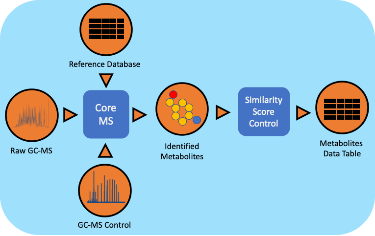

Metabolomics Workflow
==============================

Summary
-------

The gas chromatography-mass spectrometry (GC-MS) based metabolomics workflow (metaMS) has been developed by leveraging PNNL's CoreMS software framework.
The current software design allows for the orchestration of the metabolite characterization pipeline, i.e., signal noise reduction, m/z based Chromatogram Peak Deconvolution,
abundance threshold calculation, peak picking, spectral similarity calculation and molecular search, similarity score calculation, and confidence filtering, all in a single step.

Workflow Diagram
------------------

Workflow Dependencies
---------------------

Third party software
~~~~~~~~~~~~~~~~~~~~

- CoreMS (2-clause BSD)
- Click (BSD 3-Clause "New" or "Revised" License)

Database 
~~~~~~~~~~~~~~~~
- PNNL GC-MS Spectral Database

Workflow Availability
---------------------

The workflow is available in GitHub:
https://github.com/microbiomedata/metaMS

The container is available at Docker Hub (microbiomedata/metaMS):
https://hub.docker.com/r/microbiomedata/metams

The python package is available on PyPi:
https://pypi.org/project/metaMS/

The databases are available by request.
Please contact NMDC (support@microbiomedata.org) for access.

Test datasets
-------------
https://github.com/microbiomedata/metaMS/blob/master/data/GCMS_FAMES_01_GCMS-01_20191023.cdf

Execution Details
---------------------

Please refer to: 

https://github.com/microbiomedata/metaMS/blob/master/README.md#usage

Inputs
~~~~~~~~

- ANDI NetCDF for GC-MS (.cdf)
- CoreMS Hierarchical Data Format (.hdf5)
- CoreMS Parameter File (.JSON)
- MetaMS Parameter File (.JSON)

Outputs
~~~~~~~~

- Metabolites data-table
    - CSV, TAB-SEPARATED TXT
    - HDF: CoreMS HDF5 format
    - XLSX : Microsoft Excel
- Workflow Metadata:
    - JSON

Requirements for Execution
--------------------------

- Docker Container Runtime
- Python Environment >= 3.6
- Python Dependencies are listed on requirements.txt

Version History
---------------

- 2.0.4

Point of contact
----------------

Package maintainer: Yuri E. Corilo <corilo@pnnl.gov>
