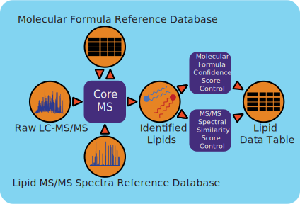

github_url

:   <https://github.com/microbiomedata/metaMS/blob/master/docs/index_lipid.rst>

# Lipidomics Workflow (v1.2.1)



## Workflow Overview

The liquid chromatography-mass spectrometry (LC-MS)-based lipidomics
workflow (part of MetaMS) is built using PNNL's CoreMS software
framework. The workflow leverages many features of CoreMS as well as
PNNL's MetabRef LC-MS database to process LC-MS/MS data and identify
lipids. The initial signal processing includes peak picking, integration
of mass features, deconvolution of MS1 spectra, and calculation of peak
shape metrics. The workflow associates MS1 spectra with their
corresponding MS2 spectra. It uses the MS2 spectra to search an
in-silico spectra database for lipids and uses the deconvoluted MS1
spectra to assign a molecular formula. Each candidate lipid assignment
is given two confidence scores: one for its match to the predicted
molecular formula based on the mass accuracy and fine isotopic structure
and a second for the MS2 spectral matching for filtering and selecting
the best match.

Note that only data collected in profile mode for MS1 and data-dependent
acquisition for MS2 is supported at this time.

## Workflow Availability

The workflow is available in GitHub:
<https://github.com/microbiomedata/metaMS/blob/master/wdl/metaMS_lcmslipidomics.wdl>

The container is available at Docker Hub (microbiomedata/metaMS):
<https://hub.docker.com/r/microbiomedata/metams>

The database is available by request. Please contact NMDC
(<support@microbiomedata.org>) for access.

## Requirements for Execution

The recommended way to run the workflow is via the provided wdl file and
the miniwdl package. Using the wdl file requires the following:

### Hardware Requirements

To run this application, we recommend a processor with at least 2.0 GHz
speed, 8GB of RAM, 10GB of free hard disk space.

### Software Requirements

-   Docker Container Runtime
-   miniwdl (v1, <https://pypi.org/project/miniwdl/>)

*Note that the wdl file will automatically pull the necessary docker
with the required workflow dependencies.*

### Database

-   A local copy of the in silico lipid spectra. See PNNL Metabref
    Database (<https://metabref.emsl.pnnl.gov/>).

The in-silico lipid spectra in PNNL\'s Metaref database are generated
from the LipidBlast database (v68), found at
<https://systemsomicslab.github.io/compms/msdial/main.html>. Note that
there is no retention time in the PNNL version of the database and the
workflow does not use retention time scoring. Currently the workflow
uses a local copy of the database, and the database is available by
request.

## Sample datasets

-   An example dataset can be downloaded from here:
    <https://nmdcdemo.emsl.pnnl.gov/lipidomics/blanchard_11_8ws97026/Blanch_Nat_Lip_H_32_AB_O_19_NEG_25Jan18_Brandi-WCSH5801.raw>
-   Example CoreMS Parameter file (applicable to the example dataset):
    <https://nmdcdemo.emsl.pnnl.gov/lipidomics/parameter_files/emsl_lipidomics_corems_params.toml>
-   Example Scan Translator file (applicable to the example dataset):
    <https://nmdcdemo.emsl.pnnl.gov/lipidomics/parameter_files/emsl_lipidomics_scan_translator.toml>

## Execution Details

This workflow should be executed using the wdl file provided in the
MetaMS package (wdl/metaMS_lipidomics.wdl).

Example command to run the workflow:

``` 
miniwdl run wdl/metaMS_lipidomics.wdl -i metams_input_lipidomics.json --verbose --no-cache --copy-input-files
```

### Inputs

To use the wdl, inputs should be specified in a json file. See example
input json file in wdl/metaMS_lipidomics.wdl.

The following inputs are required (declared in the input json file):

-   

    LC-MS/MS data file locations in one of the following formats:

    :   -   ThermoFisher mass spectrometry data files (.raw)
        -   mzML mass spectrometry data files (.mzml)

-   

    Workflow inputs (all three required):

    :   -   CoreMS Parameter file (.toml)
        -   Scan Translator Parameter file (.toml)
        -   Path to local MetabRef database (.sqlite)

-   

    Cores (optional input):

    :   -   How many cores to use for processing. Default is 1.

### Outputs

-   Lipidomics data
    -   Peak data table with annotated lipids (.csv)
    -   CoreMS HDF5 format of CoreMS LCMS object for further analysis
        and exploration (.hdf5)
-   Workflow Metadata
    -   The full set of CoreMS parameters used in the workflow, some of
        which are set dynamically within the workflow (.toml)

## Version History

-   v1.2.1: Current release
-   v1.0.0: Initial release of the lipidomics workflow Jan 9, 2025

## Point of contact

Workflow maintainer: Katherine R. Heal \<<katherine.heal@pnnl.gov>\>
